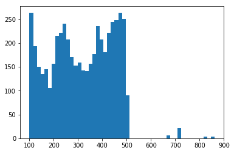
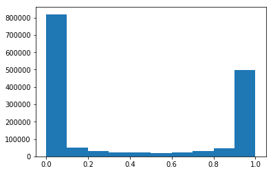
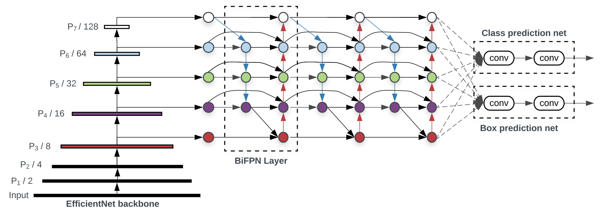

# 螺旋桨RNA结构预测竞赛第4名方案
鸣沙山下队

## 1. 比赛简介
“RNA碱基不成对概率”衡量了RNA序列在各个点位是否能形成稳定的碱基对（base pair），是RNA结构的重要属性，并可被应用在mRNA疫苗序列设计、药物研发等领域。例如mRNA疫苗序列通常不稳定，而RNA碱基不成对概率较高的点位正是易被降解的位置；又如RNA 碱基不成对概率较高的点位通常更容易与其他RNA序列相互作用，形成RNA-RNA binding等，这一特性也被广泛应用于疾病诊断（如快速肺结核检测）和RNA药物研发。

本次比赛要求参赛者构建一个模型并预测RNA碱基不成对概率（unpaired probability）。详情请点击比赛链接：[https://aistudio.baidu.com/aistudio/competition/detail/61](https://aistudio.baidu.com/aistudio/competition/detail/61)


## 2. 设计思路和实现细节
### 2.1 数据分析
数据集包括4750条训练集数据、250条验证集数据、444条A榜测试数据、112条B榜测试数据。数据集具有以下特点：
1. 数据长度不均匀，且训练集和测试集差别很大。5000条有标签数据的RNA链长度基本均匀分布在[100, 500]区间内，A榜数据最长的有3483，B榜数据最长的有861。



2. 碱基不成对概率倾向于0或1,中间状态较少。



### 2.2 整体思路
基于一维卷积实现的端到端模型，输入为特征序列，输出为一维序列，对输入序列的每一位都输出一个代表不成对概率的浮点值。

### 2.3 特征工程
本方法用到的特征主要有：
1. RNA序列one hot；
2. 题目给出的结构序列one hot，该结构实际也是linear fold；
3. linear fold的foldc函数生成的结构序列；
4. contrafold生成的结构序列，包括：
(1) 默认设置；
(2) 设置为--viterbi模式；
(3) 设置为--noncomplementary模式；
(4) 设置为--viterbi --noncomplementary模式。

生成特征的程序代码为[MakeFeatures.py](code/MakeFeatures.py)，生成的特征文件有：
- [all.fasta](work/features/all.fasta)，以fasta格式存储的所有RNA序列；
- [foldc.txt](work/features/foldc.txt)，以fasta格式存储的foldc结构序列；
- [contrafold_default.patents](work/features/contrafold_default.patents)，以fasta格式存储的contrafold结构序列（默认参数）；
- [contrafold_viterbi.patents](work/features/contrafold_viterbi.patents)，以fasta格式存储的contrafold结构序列（参数为--viterbi）；
- [contrafold_noncomp.patents](work/features/contrafold_noncomp.patents)，以fasta格式存储的contrafold结构序列（参数为--noncomplementary）；
- [contrafold_noncomp_viterbi.patents](work/features/contrafold_noncomp_viterbi.patents)，以fasta格式存储的contrafold结构序列（参数为--viterbi --noncomplementary）。

输入网络前，对RNA序列和结构序列都进行one hot编码，堆叠形成特征序列。再把特征序列填充为相同长度，两端均采用0填充以尽量满足对称性。由于训练集数据长度比较集中，测试集数据存在部分超长序列，故对训练集数据和测试集数据采用不同的填充长度。

### 2.4 网络架构
采用类似于EfficientDet中的Bifpn架构，首先构建一个逐层下采样的backbone网络，并提取金字塔特征，再构建一个Bifpn网络融合不同层次的特征，最后用一个逐层上采样网络恢复为原始序列长度。这里盗用一下EfficientDet的图，仅仅把右边的检测头替换为一组上采样网络。


#### 2.4.1 backbone
采用若干组一维卷积堆叠，每组卷积后增加MaxPool1D以下采样。每组输出对应自己分辨率的特征，组合成最终的金字塔特征组，作为后续Bifpn网络的输入。和图像卷积舍弃前3层特征不同，RNA序列中的每一位都很重要，所以特征金字塔是从第一层（和输入等长）起算的。前向网络主要代码如下：
```
    features = []
    for layer_id, layer in enumerate(self.layers):
        x = layer(x)
        features.append(x)
        if layer_id == len(self.layers)-1:
            x = paddle.nn.MaxPool1D(2)(x)
        if self.dropout_rate>0:
            x = paddle.nn.Dropout(self.dropout_rate)(x)
    return features
```

#### 2.4.2 bifpn
仿照EfficientDet实现。输入是一组金字塔特征，输出是一组相同长度（特征维度不同）的金字塔特征。这里不再赘述。

#### 2.4.3 UpStage（上采样网络）
从底层开始，逐层上采样并融合同层的特征，直至与原序列长度相同为止。输入为金字塔特征组，输出为和原序列长度一致的特征向量。前向网络主要代码如下：
```
    def forward(self, features):
        N = len(features)
        features = [conv(f) for conv, f in zip(self.convs, features)]
        x = features[-1]
        for i in range(N-2, -1, -1):
            x = paddle.add_n([features[i], self.ups[i](x)])
        return x
```

#### 2.4.4 BifpnModel（整体模型）
组合上述三个网络模块，在最后增加一个输出特征维度为1的一维卷积，以作为不成对概率的输出。

此外，为了能够更灵活的更改网络，编写代码以支持根据参数更改网络结构设置，具体如下：
```
BACKBONE=[
    [('MBConv',4,7),],
    [('MBConv',8,5),('MBConv',8,5),],
    [('MBConv',16,5),('MBConv',16,5),],
    [('MBConv',32,5),('MBConv',32,5),],
    [('MBConv',48,5),('MBConv',48,5),],
    [('MBConv',64,5),('MBConv',64,5),],
]
BIFPN_SETTING=[('Conv',8,5),('Conv',8,5),('Conv',8,5),('Conv',4,5),]
UP_STAGE = ('Conv',4,5)
```
- BACKBONE为二维list，每个一维list为一组卷积，组与组之间会自动插入MaxPool层。每个卷积设置中表示采用哪个卷积函数、卷积核个数（特征维度）、卷积核尺寸（kernel size）。
- BIFPN_SETTING表示有多少组bifpn网络，每组的深度自适应backbone输出的金字塔特征层数。卷积核设置同上。
- UP_STAGE表示上采样网络的卷积层设置。

### 2.5 模型训练和预测
本方法采用Adam优化器，loss采用与题目相同的RMSD，训练最大轮数为100（一般训练30-40就手动停掉了），batch size为16，学习率为1e-4。此外，采取了如下措施：
1. 5个epoch的学习率warm up；
2. 学习率线性衰减。

其他未尽事宜可见代码中相应的注释。

## 3 优缺点及改进方向
### 3.1 优点
1. 端到端模型，比较简单、易于理解；
2. 融合了多种结构生成算法，模型具有较好的鲁棒性。事实上，B榜本人仅提交了3次，没有刻意调节尝试各种参数等，就取得了较好的效果；
3. 卷积模型相对于lstm等循环神经网络，由于并行度较高，速度上有较大优势。

### 3.2 缺点
1. 对超长序列，卷积模型空间（显存占用）复杂度较高，限制了其应用；
2. 没有融合多模型的结果。根据以往比赛经验，最优结果往往是融合了CNN、RNN、树模型（lgb等）多模型的结果，效果会比较好；
3. 由于未知原因，同一个模型多次预测，得到的结果会有差异，无法做到精确复现。

### 3.3 改进方向
1. 进一步挖掘RNA序列特征；
2. 采用autoDL等技术，进一步挖掘更优的网络结构设置；
3. 时空间复杂度许可的情况下，采用多模型融合。
